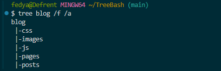
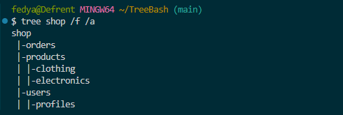
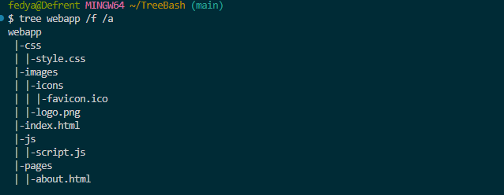
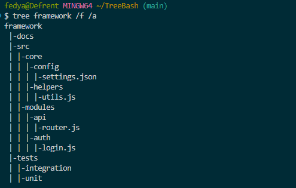
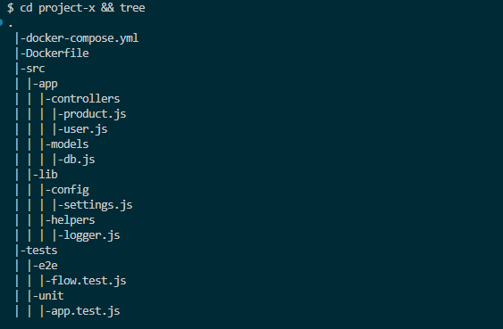
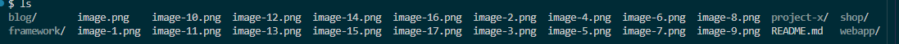
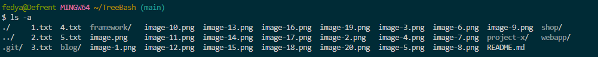
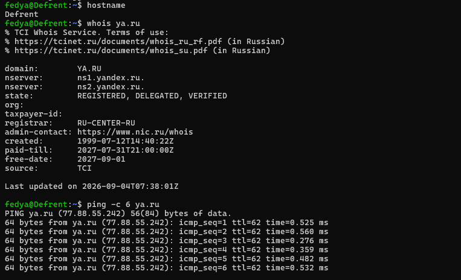

## Самостоятельная работа по командной строке Bash

Выполнять задания, используя bash-выражения типа `mkdir -p project/{css,js,img/ico,fonts,pages}`

> ## Задания выполнять на [Github.com](github.com) или [Gitflic.ru](https://gitflic.ru/)

> ### Для выполнения этих заданий нужно создать новый публичный репозиторий с README.md

> ### Для выполнения этих заданий нужно использовать VSCode и git

1. Создание простой структуры блога
    ```text
    blog/
    ├── posts/
    ├── pages/
    ├── images/
    ├── css/
    └── js/
    ```

```bash
mkdir -p blog/{posts,pages,images,css,js}
```



1. Двухуровневая структура интернет-магазина
    ```text
    shop/
    ├── products/
    │   ├── electronics/
    │   └── clothing/
    ├── users/
    │   └── profiles/
    └── orders/
    ```
```bash
mkdir -p shop/{products/{electronics,clothing},users/profiles,orders}
```



1. Структура веб-проекта с файлами
    ```text
    webapp/
    ├── css/
    │   └── style.css
    ├── js/
    │   └── script.js
    ├── images/
    │   ├── logo.png
    │   └── icons/
    │       └── favicon.ico
    ├── pages/
    │   └── about.html
    └── index.html

```bash
mkdir -p webapp/css webapp/js webapp/images/icons webapp/pages && touch webapp/index.html webapp/css/style.css webapp/js/script.js webapp/images/logo.png webapp/images/icons/favicon.ico webapp/pages/about.html
```

    
    
 

1. Проект с шаблонами и конфигами
    ```text
    framework/
    ├── src/
    │   ├── core/
    │   │   ├── config/
    │   │   │   └── settings.json
    │   │   └── helpers/
    │   │       └── utils.js
    │   └── modules/
    │       ├── auth/
    │       │   └── login.js
    │       └── api/
    │           └── router.js
    ├── tests/
    │   ├── unit/
    │   └── integration/
    ├── docs/
    └── .github/
        └── workflows/
            └── test.yml
    ```

```bash
mkdir -p framework/{src/{core/{config,helpers},modules/{auth,api}},tests/{unit,integration},docs,.github/workflows} && touch framework/src/core/config/settings.json framework/src/core/helpers/utils.js framework/src/modules/auth/login.js framework/src/modules/api/router.js framework/.github/workflows/test.yml
```



1. Генерация структуры по описанию (рекомендую использовать ИИ)
    ```text
    Описание структуры:
    - Корень: project-x
    - Внутри: src (с подпапками app и lib), tests (с подпапками unit и e2e)
    - В src/app: controllers (с файлами user.js и product.js), models (с файлом db.js)
    - В src/lib: helpers (с файлом logger.js), config (с файлом settings.js)
    - В корне: файлы .env, Dockerfile, docker-compose.yml
    - В tests/unit: файл app.test.js
    - В tests/e2e: файл flow.test.js
    ```
```bash
mkdir -p project-x/{src/{app/{controllers,models},lib/{helpers,config}},tests/{unit,e2e}} && touch project-x/{.env,Dockerfile,docker-compose.yml,src/app/controllers/{user.js,product.js},src/app/models/db.js,src/lib/helpers/logger.js,src/lib/config/settings.js,tests/unit/app.test.js,tests/e2e/flow.test.js}
```



1. Выполнить команды из [примеров](/content/Bash/BashCLI.md) - сохранить их вывод в скриншотах, кроме сетевых команд
1.
1. 






> ### Результаты с содержанием выражений запушить и прислать мне ссылку

## 💡 **Советы для студентов:**
- Используйте сервисы **Github** или **Gitlab** для удалённого хранения кода
- Тестируйте ваши скрипты, прежде чем отправить их в облако
- Начинайте с простых задач
- Всегда сначала проверяйте команду в отдельной папке (mkdir test && cd test).
- Используйте tree для визуализации (tree -a --dirsfirst).
- Разбивайте сложные структуры на части, если не уверены.
- Помните, что {a,b} работает только в Bash, не в sh (но вам это пока не важно).
- Экспериментируйте с echo {a,b}/{c,d} — это безопасный способ проверить, что сгенерируется.

> Если вы обнаружили ошибку в этом тексте - сообщите пожалуйста автору!